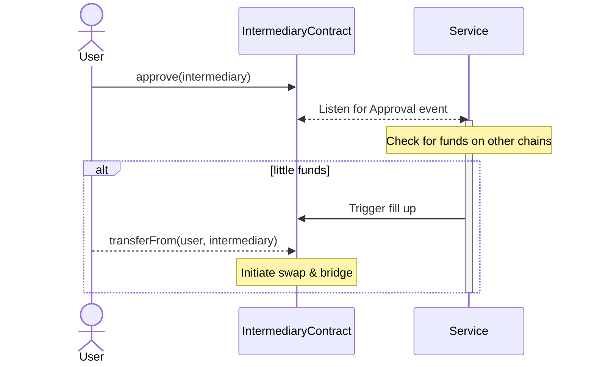

# CREATED FOR ETHGLOBAL SINGAPORE
https://ethglobal.com/showcase/fill-me-up-9u13c

# Fill Me Up
Never worry about gas fees again! Approve funds on one chain and all chains are automatically refilled.

## Problem
**Gas cost is annoying!**
You need to maintain gas on every chain you interact with, and eventually, you'll run out on some of them. 

## Solution
With this project, you can approve funds on a single chain. Whenever you're low on gas on any chain, your balance will automatically be filled up using those approved funds. This ensures you only spend the minimum necessary to keep just enough gas on all chains, saving you from the hassle of manual refills.

## Technical
This project utilizes an intermediary contract to which users approve their funds. 
A central service monitors the gas levels of users who have approved funds. When a user's gas is low, the service calls the intermediary contract, which uses the approved allowance to transfer some funds to itself. It then swaps and bridges the funds to the chain that is running low. 
Since the contract can only transfer funds to the same user address on another chain, users maintain complete control and security, with no risk of losing their assets.

## Contracts

### Hyperlane
[sepolia](https://sepolia.etherscan.io/address/0x1bbf7Cd3ECa39B4a49C782Aa4A22a2e17233a4Ca)

[scroll-sepolia](https://sepolia.scrollscan.com/address/0xae75340eaFCE2B8b7740b3F731743f35b3c541e5)

### LayerZero
[sepolia](https://sepolia.etherscan.io/address/0x11545fE290A922c557274D4b53Ef3880175D40D8)

[base-sepolia](https://sepolia.basescan.org/address/0x4CD5D8EC1e9C3909d14f378f3348F3AB0A04E172)

[arbitrum-sepolia](https://sepolia.arbiscan.io/address/0xCF06f7BC9D3Cd7b068F059AB4c19f237F3A40F8C)

[polygon-amoy](https://www.oklink.com/amoy/address/0xcf06f7bc9d3cd7b068f059ab4c19f237f3a40f8c)

[optimism-sepolia](https://sepolia-optimism.etherscan.io/address/0xCF06f7BC9D3Cd7b068F059AB4c19f237F3A40F8C)

[morph](https://explorer-holesky.morphl2.io/address/0xCF06f7BC9D3Cd7b068F059AB4c19f237F3A40F8C)

### BridgeSelector

[sepolia](https://sepolia.etherscan.io/address/0x290e31032c33331d724298544663db502c8cc77d)

